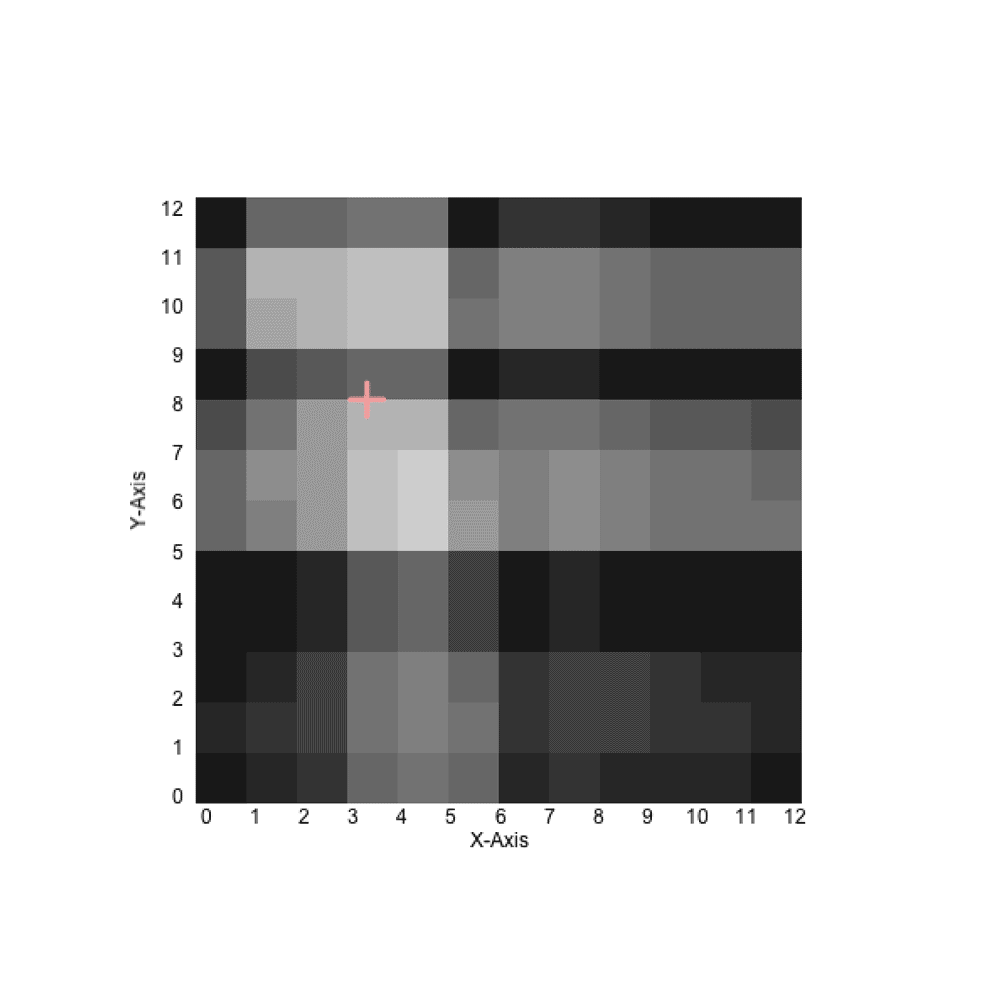

## lefeel XYZ
**Textile device used to capture the touch**

###### Description

Lefeel is a research project of teleportation of the touch through a portable textile surface.

###### Tutorial

We wrote a tutorial to realize this textile device :
[https://humain-humain.github.io/lefeel_music/](https://humain-humain.github.io/lefeel_music/)

###### Credit

- Concept and Design : [Humain–Humain.fr](http://humain–humain.fr)
- Development : Bastien DIDIER

###### Gallery

