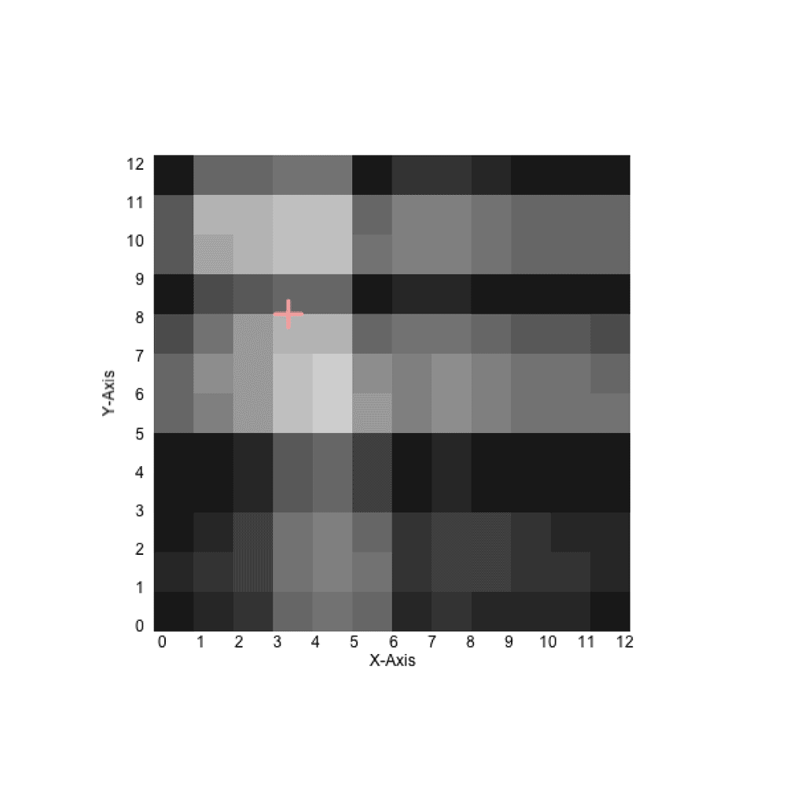

## lefeel XYZ

#### Draw sensors matrix


```
for(int i=0; i<=maxNumberOfSensors-1; i++){
	if(i % cols == 0 && i != 0){
		addCols++;
		addRow = 0;
	}
	fill(sensorValue[i]);
	rect((width/2-mapWidth/2)+addRow*rectSize, (height/2-mapHeight/2)+addCols*rectSize, rectSize,rectSize);
	addRow++;
}  
```

#### draw points where the pression is high


```
if(sensorValue[i] > 100){
	fill(255,0,0);
	ellipse(((width/2-mapWidth/2)+addRow*rectSize)+rectSize/2, ((height/2-mapHeight/2)+addCols*rectSize)+rectSize/2, rectSize/3, rectSize/3);
	ellipsCount++;
}
```

#### Looking for the barycenter of this points



```
barycentreX += ((width/2-mapWidth/2)+addRow*rectSize)+rectSize/2;
barycentreY +=((height/2-mapHeight/2)+addCols*rectSize)+rectSize/2;
      
barycentreX = barycentreX/ellipsCount;
barycentreY = barycentreY/ellipsCount;

fill(0,255,0);
ellipse(barycentreX,barycentreY,rectSize,rectSize);
```